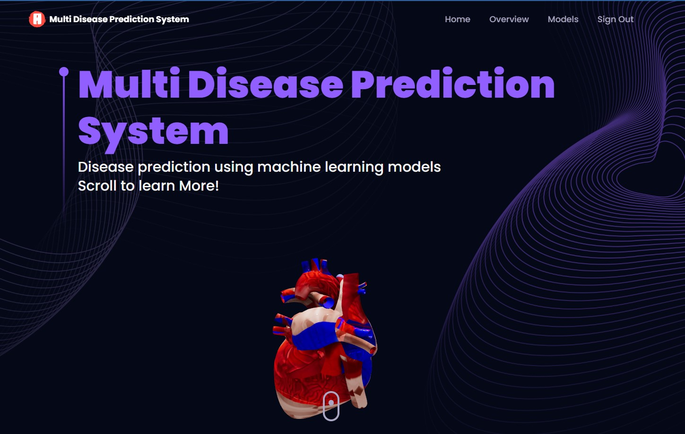
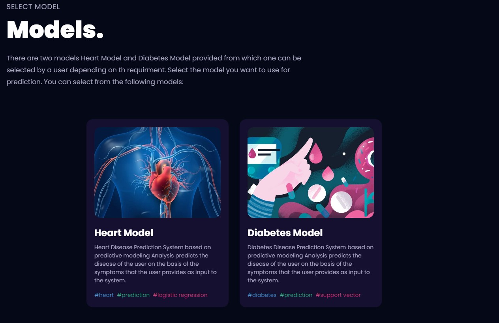
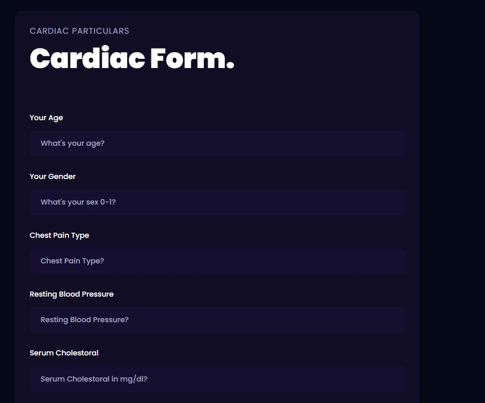
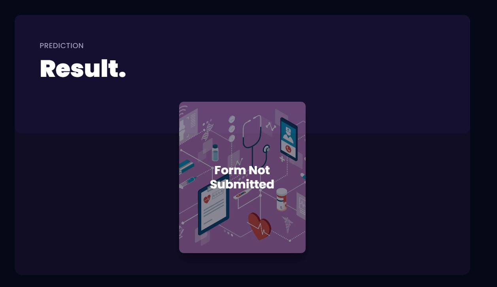

# Multi Disease Prediction System



## Table of Contents

- [Introduction](#introduction)
- [Tech Stack](#tech-stack)
- [Main Problem](#main-problem)
- [Abstract](#abstract)
- [Features](#features)
- [Getting Started](#getting-started)
  - [Prerequisites](#prerequisites)
  - [Installation](#installation)
- [Usage](#usage)
- [Contributing](#contributing)
- [License](#license)
- [Acknowledgments](#acknowledgments)

## Introduction

The **Multi Disease Prediction System** is a predictive modeling project that predicts diseases based on user-provided symptoms. It analyzes user-provided symptoms and provides the probability of a disease as output. This system aims to improve healthcare by enabling early disease detection and intervention.

## Tech Stack

- Frontend: React
- Backend: Express / Nest.js
- Database Management System (DBMS): MySQL / PostgreSQL
- Machine Learning Models: Support Vector Machine Classifier and Logistic Regression (Python)

## Main Problem

The project proposal is to create a low-cost health monitoring system that can analyze collected data and make robust predictions. Traditional statistical data analysis has limitations when dealing with numerous parameters, while machine learning models can effectively extract patterns. Existing healthcare analysis models often focus on a single disease per analysis, lacking a unified system for multi-disease prediction.

In this project, we present a **Multi Disease Prediction System** that encompasses the analysis and prediction of both heart and diabetic diseases. We use Logistic Regression for heart disease analysis and Support Vector Machine for diabetic disease analysis.

## Abstract

In recent years, heart and diabetic diseases have emerged as significant public health concerns worldwide, resulting in substantial healthcare costs. Therefore, there is a pressing need for a cost-effective health monitoring system capable of analyzing collected data and making accurate predictions. Traditional statistical data analysis approaches have limitations when it comes to deriving insights from numerous parameters. In contrast, machine learning models can handle large datasets with multiple parameters and effectively extract patterns. 

Many existing machine learning models for healthcare analysis focus on a single disease per analysis, such as one model for heart disease analysis and another for diabetic analysis. Consequently, there is a lack of a unified system that can predict multiple diseases. 

In this project, we present a Multi Disease Prediction System that encompasses the analysis and prediction of both heart and diabetic diseases. We employ two prominent machine learning algorithms for disease prediction:

1. **Logistic Regression for Heart Disease:** This algorithm is utilized for analyzing and predicting heart diseases based on input symptoms and patient data.

2. **Support Vector Machine for Diabetic Disease:** Support Vector Machine (SVM) is employed to analyze and predict diabetic diseases, taking into account relevant symptoms and patient information.

Our goal is to provide a comprehensive and versatile platform that can assist healthcare professionals in predicting and managing multiple diseases simultaneously. By leveraging machine learning, we aim to improve the accuracy of disease prediction, enabling early intervention and better patient care. 

This project seeks to make a significant contribution to the field of healthcare analysis and disease prediction by offering a unified solution for multi-disease prediction, thereby enhancing the efficiency of medical diagnosis and treatment.

## Features

- Predicts heart and diabetic diseases based on user-provided symptoms.
- Utilizes machine learning algorithms for accurate disease prediction.
- Provides probability scores for disease prediction.
- Supports both MySQL and PostgreSQL as database management systems.
- Offers a user-friendly React-based frontend.
- Enables healthcare professionals to make early interventions.







## Getting Started

### Prerequisites

- Node.js and npm (Node Package Manager) installed on your system.
- A code editor such as Visual Studio Code.

### Installation

1. Clone the repository:

   ```sh
   git clone https://github.com/your-username/multi-disease-prediction.git

2. Navigate to the project directory:

    ```sh
    cd multi-disease-prediction

3.  Install all dependencies:

    ```sh
    install

4. Run project:

    ```sh
    npm run server
    npm run client

